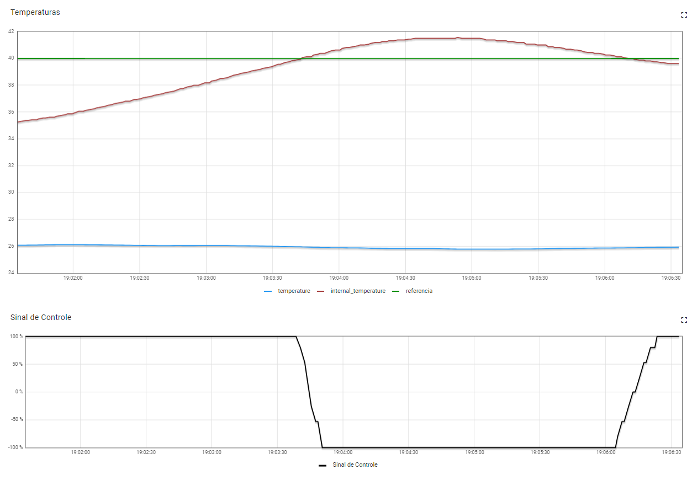
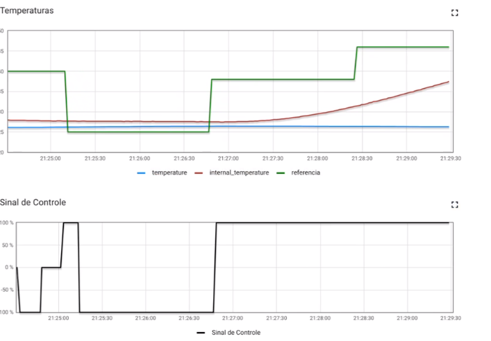

# FSE TRABALHO 2 2022.

Trabalho 2 da disciplina de Fundamentos de Sistemas Embarcados (2022/2)

Aluno: Thiago Luiz de Souza Gomes 
Matrícula: 180028324

## Descrição
A descrição do projeto [aqui](https://gitlab.com/fse_fga/trabalhos-2022_2/trabalho-2-2022-2)

## Como Utilizar
### Etapa 1:
Execute o seguinte comando no terminal 
```bash
    python3 main.py
```  

### Etapa 2:

Siga os comandos do terminal, para escolher se deja setar um valor fixo para a temperatura referencial, e se deseja escolher os valores dos parâmetros do PID Kp,Ki,Kd

### Etapa 3:
Acompanhe pelo dashboard da placa escolhida.

* Ligue o Forno
* Inicie o aquecimento

Observe os acionamentos do resistor e da ventoinha pelo sinal de controle
e acompanhe a curva de temperatura interna se igualar a curva da temperatura referencial.
Pode-se alterar o valor da temperatura de referência pelo dashboard.
### Etapa 4:
Uso das curvas reflow

* Clique na opção de curvas

Acompanhe as curvas de referências se alterando conforme o tempo e a curva de temperatura interna acompanhando com a curva de sinal de controle.


### Imagens
Curvas com o valor de temperatura de referência fixos:




Curvas seguindo os valores de referências do arquivo de csv:



